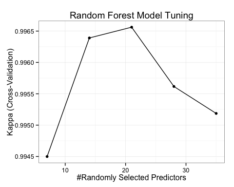
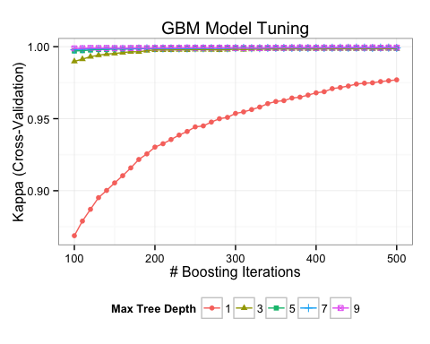

# Practical Machine Learning: Course Project
James Morse  
February 17, 2015  

### Overview: Human Activity Recognition  
The objective is to use activity tracking device data to correctly recognize 
different types of physical activities. For this project, we will use supervised
machine learning to classify observed movements as are either correctly 
performed barbell lifts or one of five incorrect barbell lift techniques. 
Training and test data was sourced from [Groupware@LES](http://groupware.les.inf.puc-rio.br/har).  

### Data Preparation
First, we load the training data file and pare down the data set to the 
response variable and relevant predictors. About two-thirds of the measure 
columns are not usable due to a majority of values being missing, so we drop them.  

```r
library(data.table)
library(plyr);library(dplyr)
```

```
## 
## Attaching package: 'dplyr'
## 
## The following objects are masked from 'package:plyr':
## 
##     arrange, count, desc, failwith, id, mutate, rename, summarise,
##     summarize
## 
## The following objects are masked from 'package:data.table':
## 
##     between, last
## 
## The following object is masked from 'package:stats':
## 
##     filter
## 
## The following objects are masked from 'package:base':
## 
##     intersect, setdiff, setequal, union
```

```r
# load training data file, looking for 3 different types of missing values
train.data <- fread("data/pml-training.csv", stringsAsFactors=FALSE, na.strings=c("NA","#DIV/0!",""))

# tidy up data for model building
train.data <- train.data %>%
     # convert discrete dimensions stored as strings to factors,
     #  date/time strings as POSIXct,
     #  and V1 as integer
     mutate(classe = as.factor(classe),
            user_name = as.factor(user_name),
            new_window = as.factor(new_window),
            cvtd_timestamp = as.POSIXct(strptime(cvtd_timestamp, "%d/%m/%Y %H:%M")),
            V1 = as.integer(V1)
           ) %>%
     # select only fields where the majority of rows are NOT missing/empty
     select(
          which(
               sapply(train.data,
                      function(x) { sum(is.na(x)) / length(x) >= 0.5}
                      ) == FALSE
               )
          ) %>%
     # exclude row number, user name, and timestamp fields since they aren't
     #  relevant as predictors
     select(-V1, -user_name, -contains("timestamp"))
```

Next, we split out the data used in the model building into "build" and 
"validation" sets, balancing the split on the response field `classe`.

* The __build__ subset (75%) will be used to train models using cross-validation.  
* The held-out __validation__ set (25%) will be used to compare estimated out-of-sample 
error rates between the selected model versions from each algorithm that we use.  

```r
library(caret)
```

```
## Loading required package: lattice
## Loading required package: ggplot2
```

```r
set.seed(245613579)
# 75% for training and 25% for validation 
build.index <- as.vector(createDataPartition(train.data$classe, p=0.75, list=FALSE))
build.data <- train.data[build.index]
validation.data <- train.data[-build.index]

build.data.response <- build.data$classe
validation.data.response <- validation.data$classe
```

### Model Training & Tuning   
We're going to train and tune models using two of the most popular machine 
learning algorithms:

* __Random Forest__  
    + `mtry` - number of predictors to randomly select for inclusion within each
    tree grown  
* __Gradient Boosting Machine (GBM)__  
    + `n.trees` - number of trees to grow  
    + `interaction.depth` - maximum allowed levels of any tree branch  
    + `shrinkage` - learning rate or step-size of each tree iteration  

For each algorithm, I will set tuning parameters, which the `caret` package will
use to build multiple model versions and then pick the best performing version 
using 5-fold cross validation and Kappa as the metric to maximize. I'm using 
Kappa instead of Accuracy since Kappa accounts for class imbalances in the data.  

Alos, we'll attempt to ensemble the best-tuned models for each to see if blending
the two algorithms improves out-of-sample error.  


```r
library(doMC)
library(randomForest)
library(gbm)

# set to run in parallel using 5 cores
registerDoMC(cores = 5)

# train using 5-fold CV w/ parallel processing
train.control <- trainControl(method = "cv",
                              number = 5,
                              verboseIter = TRUE,
                              savePredictions = FALSE,
                              classProbs = FALSE,
                              allowParallel = TRUE)

# set tuning parameter object
tune.grid.rf <- expand.grid(mtry = c(7, 14, 21, 28, 35))

# capture time just before starting
rf.train.start <- Sys.time()
set.seed(13579)
# train Random Forest model
fit.rf <- train(
               classe ~ .,
               data = copy(build.data),
               method = "rf",
               metric = "Kappa",
               trControl = train.control,
               tuneGrid = tune.grid.rf,
               proximity = TRUE,
               ntree = 501
          )
```

```
## Aggregating results
## Selecting tuning parameters
## Fitting mtry = 21 on full training set
```

```r
# capture time elapsed to train model
rf.train.runtime <- difftime(Sys.time(), rf.train.start, units = "mins")

# set tuning parameter object
tune.grid.gbm <- expand.grid(interaction.depth = seq(1, 9, by=2),
                             n.trees = seq(100, 500, by=10),
                             shrinkage = 0.2)

# capture time just before starting
gbm.train.start <- Sys.time()
# train GBM model
set.seed(13579)
fit.gbm <- train(classe ~ .,
                 data = copy(build.data),
                 method = "gbm",
                 verbose = FALSE,
                 metric = "Kappa",
                 trControl = train.control,
                 tuneGrid = tune.grid.gbm)
```

```
## Aggregating results
## Selecting tuning parameters
## Fitting n.trees = 380, interaction.depth = 9, shrinkage = 0.2 on full training set
```

```r
# capture time elapsed to train model
gbm.train.runtime <- difftime(Sys.time(), gbm.train.start, units = "mins")


# turn off multi-core parallel processing
registerDoMC(cores = 1)
```
**Model Build Times**  

* __Random Forest:__ 20.69 minutes  
* __GBM:__ 17.76 minutes  

**Model Tuning Plots**  
  

**Best Models' Tuning Parameters**  

*  Random Forest: 21  _(randomly selected predictors)_
*  GBM: 380, 9, 0.2 _(trees, interaction depth, shrinkage)_

### Hold-Out Validation Set Performance  
Now, we apply the best-tuned Random Forest and GBM models our held-out validation
set as a secondary test of their performances on new data.  

```r
# predict classes on validation set for each model
validation.preds.rf <- predict(fit.rf, validation.data)
validation.preds.gbm <- predict(fit.gbm, validation.data)
# tabulate misclassifications & error rates for each model
validation.misclass.count.rf <- sum(validation.preds.rf != validation.data.response)
validation.misclass.count.gbm <- sum(validation.preds.gbm != validation.data.response)
validation.rows <- nrow(validation.data)
validation.error.rate.rf <- validation.misclass.count.rf / validation.rows
validation.error.rate.gbm <- validation.misclass.count.gbm / validation.rows
# get class probabilities for each model
validation.prob.preds.rf <- predict(fit.rf, validation.data, type="prob")
validation.prob.preds.gbm <- predict(fit.gbm, validation.data, type="prob")
# get class probs for ensemble model equally weighting the RF & GBM models
validation.prob.preds.ensemble <- (validation.prob.preds.gbm + validation.prob.preds.rf) / 2
# get class predictions for ensemble model
validation.preds.ensemble <- factor(max.col(validation.prob.preds.ensemble), labels=c("A","B","C","D","E"))
# tabulate misclassifications & error rate for ensemble
validation.misclass.count.ensemble <- sum(validation.preds.ensemble != validation.data.response)
validation.error.rate.ensemble <- validation.misclass.count.ensemble / validation.rows
```
_(4904 validation cases)_  

* __Random Forest:__ __8__ incorrect cases or __0.16313%__ error rate
* __Gradient Boosting Machine (GBM):__ __0__ incorrect cases or __0%__ error rate
* __Ensemble of Above Two, Equally Weighted:__ __0__ incorrect cases or **0%** error rate 

The above error rates are reasonable estimates of the out-of-sample error rates
that we would observe on new data generated from the same process. Both models
perform exceptionally well, but GBM was 100% accurate. Thus, there is not much
point in ensembling the GBM model with the Random Forest model.  

### Variable Importance
To get a sense of how the features are used in these models that have large collections
of decision trees, we use the __relative variable importance__ metric. Below are
the 10 most important variables in the GBM model.  

```r
var.imp.rf <- 
     cbind(
          Feature=row.names(varImp(fit.rf)$importance), 
          varImp(fit.rf)$importance
          ) %>%
     arrange(desc(Overall))

var.imp.gbm <- 
     cbind(
          Feature=row.names(varImp(fit.gbm)$importance), 
          varImp(fit.gbm)$importance
          ) %>%
     arrange(desc(Overall))
# show top 10 most important features
head(var.imp.gbm,10)
```

```
##              Feature    Overall
## 1         num_window 100.000000
## 2          roll_belt  50.056622
## 3      pitch_forearm  29.611195
## 4           yaw_belt  25.747412
## 5  magnet_dumbbell_y  18.708849
## 6  magnet_dumbbell_z  18.133367
## 7         pitch_belt  13.610270
## 8      magnet_belt_z  12.456010
## 9       roll_forearm  11.112260
## 10  accel_dumbbell_z   9.016518
```
Note that the Random Forest model is similar, with the top 
__4__ most important 
variables matching the GBM model's.  

### Predicting Test Data  
Finally, we load the test data and make predictions using both models.  

```r
# load test data
test.data <- fread("data/pml-testing.csv", stringsAsFactors=FALSE, na.strings=c("NA","#DIV/0!",""))
# predict test data for both models
test.preds.gbm <- predict(fit.gbm, newdata=test.data)
test.preds.rf <- predict(fit.rf, newdata=test.data)
```
_On how many cases do the 2 models' predictions disagree?_ 
__0 cases!__  

Since both models agree for all cases, we don't need to bother with producing
an ensemble prediction of the two models.  

```r
# function definition to write prediction file for each case/problem ID
pml_write_files = function(x){
  n = length(x)
  for(i in 1:n){
    filename = paste0("problem_id_",i,".txt")
    write.table(x[i],file=filename,quote=FALSE,row.names=FALSE,col.names=FALSE)
  }
}
# write prediction submission files
pml_write_files(test.preds.gbm)
```
